Vul onderstaande aan met de antwoorden op de vragen uit de readme.md file. Wil je de oplossingen file van opmaak voorzien? Gebruik dan [deze link](https://github.com/adam-p/markdown-here/wiki/Markdown-Cheatsheet) om informatie te krijgen over
opmaak met Markdown.

a)
### Working with docker in JENKINS

To work with docker in jenkins first install docker on the machine where JENKINS is installed.

After installing docker you will  notice that it can't be ran by a normal user, only by sudoers.
To fix this we will add our users who  need to use the DOCKER commands to the "docker" group.

To do this follow this guide: 

1. OPEN A TERMINAL
2. EXECUTE THE FOLLOWING COMMANDS:

The first command will add our personal user to the docker group, of course assuming that the "$USER" enviorment variable
is filled in. To check this type the following command: "echo $USER"

Now let's move over to JENKINS.

### Jenkins and Docker

## Installing the docker plugin

To begin using docker in our scripts we will need to add the docker plugin to our jenkins.

Now that is done we will  need to add a docker credential to  "JENKINS".

You can follow the same steps from our previous excercise to add a credential of your "DOCKER USER NAME" and "DOCKER USER PASSWORD".

Once that's done you can begin using DOCKER in your jenkinsfile.

b)

### Allowing communication between Jenkins & AWS EC2

## Prerequisites

1. Ensure you have a AWS account.
2. Create the virtual machine
   - from the home screen search for "EC2"
     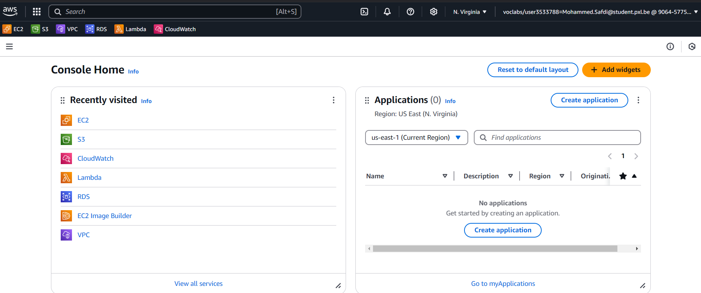
   - Click on "instances" on the right hand side
     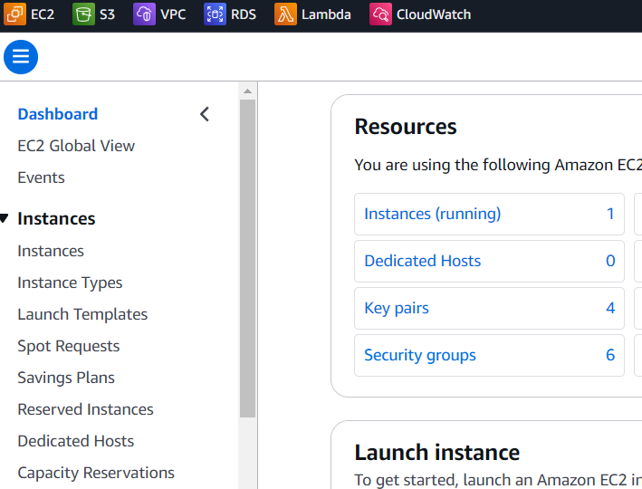
   - Click on "launch instances"
     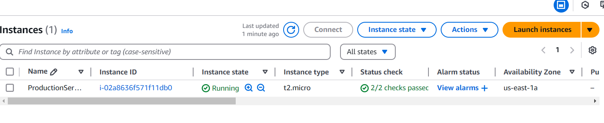
   - Go through the follwoing steps:
     - Naming the "EC2"
       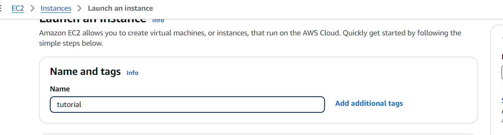
     - Selecting the right "ami"
       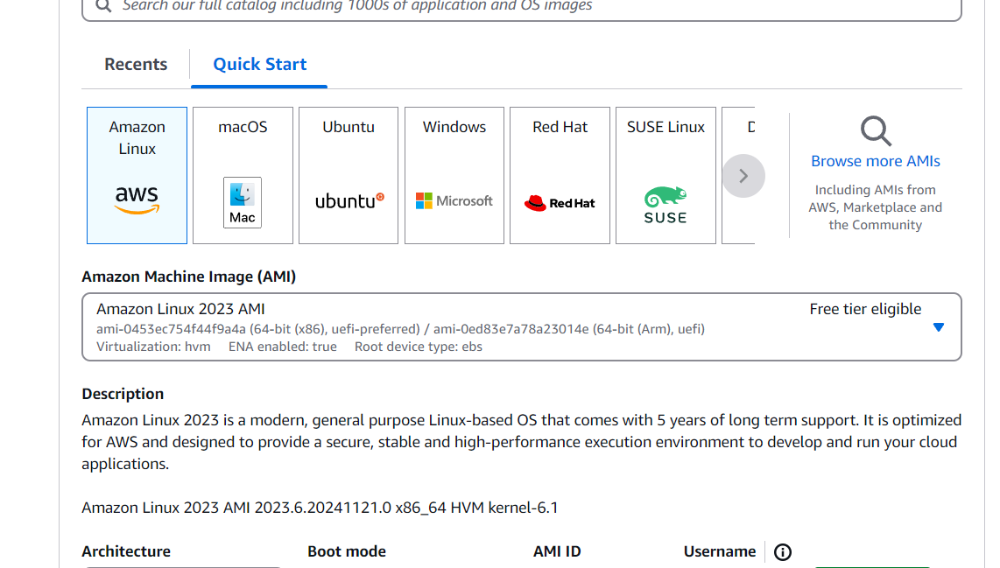
     - Depending on if you have created a key, you may need to create one
        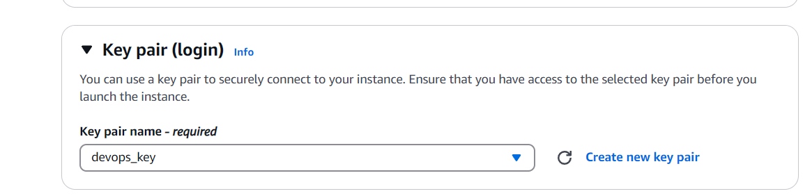
     - For the network settings you'll have to create a 
       few things: "vpc, public subnet, route table, security group"
       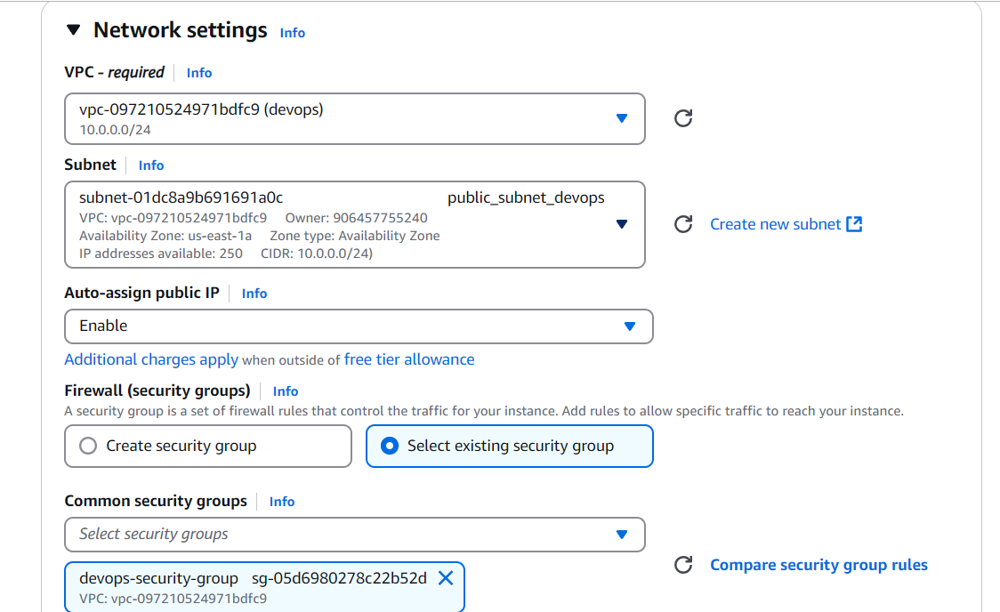
     - In the advanced section add this script
       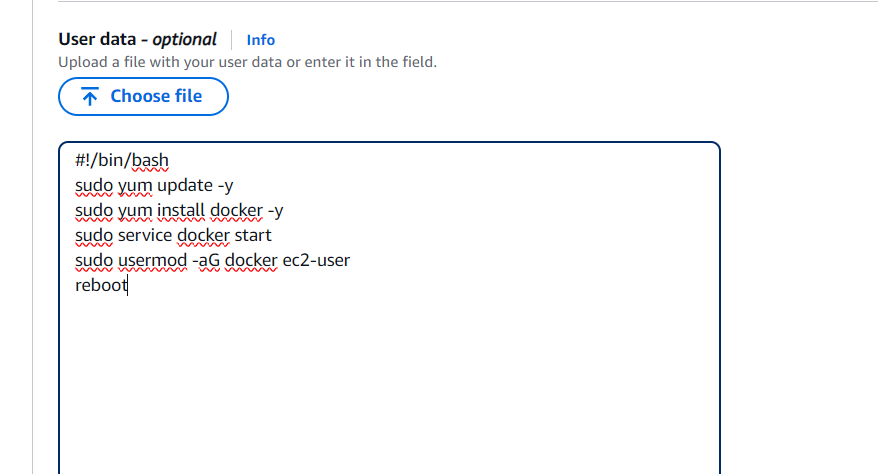
     - Before you create the machine make sure you note down the user.
       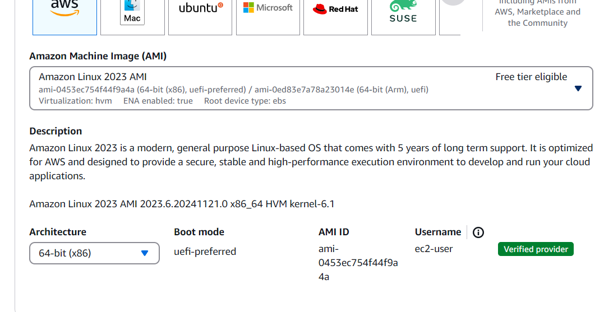
     - Now create the EC2

3. In jenkins' home folder add the directory ".aws"
   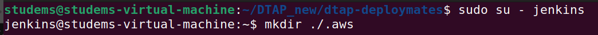
4. put the aws credentials in .aws
    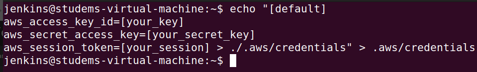
5. Put the private key of the "EC2" into jenkins' credential manager
    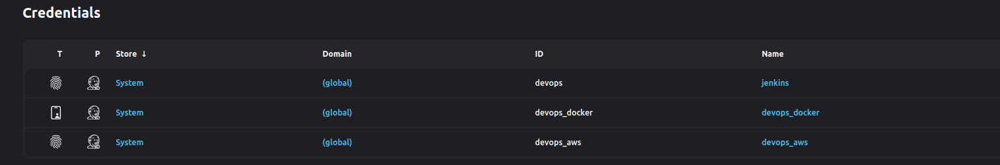
6. First test your connection then you can move onto the production file
    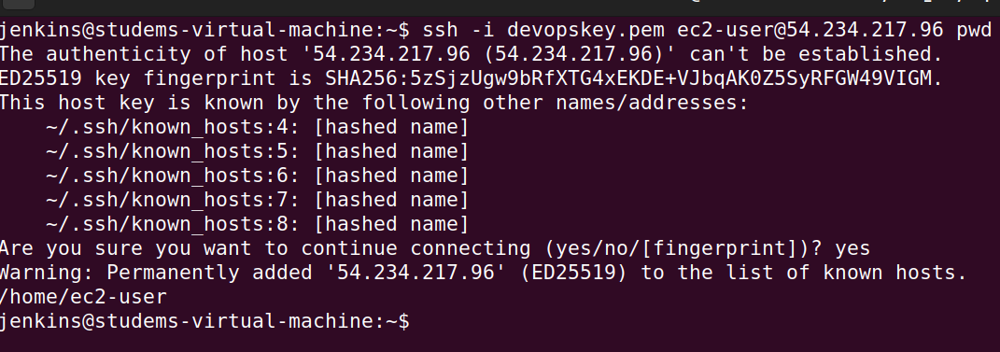
    
        
